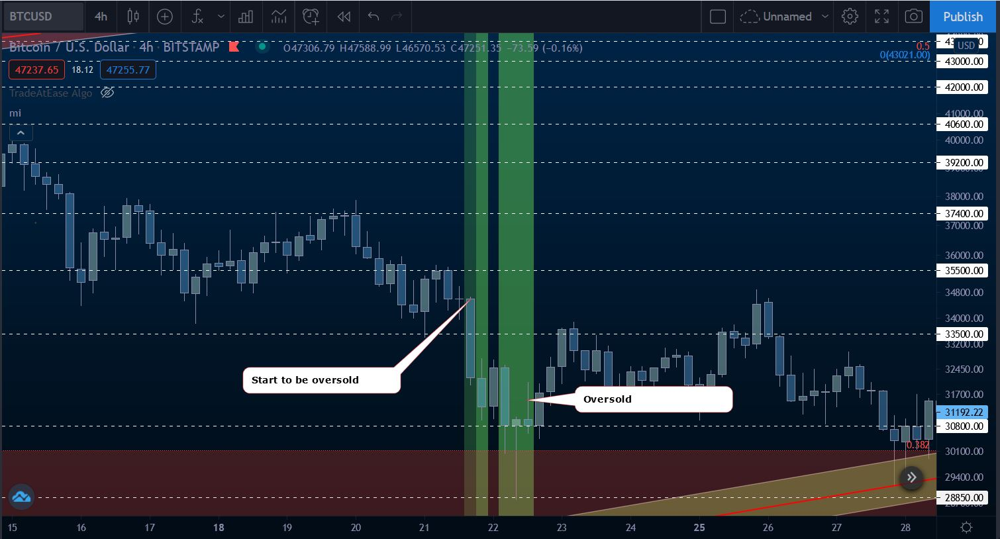
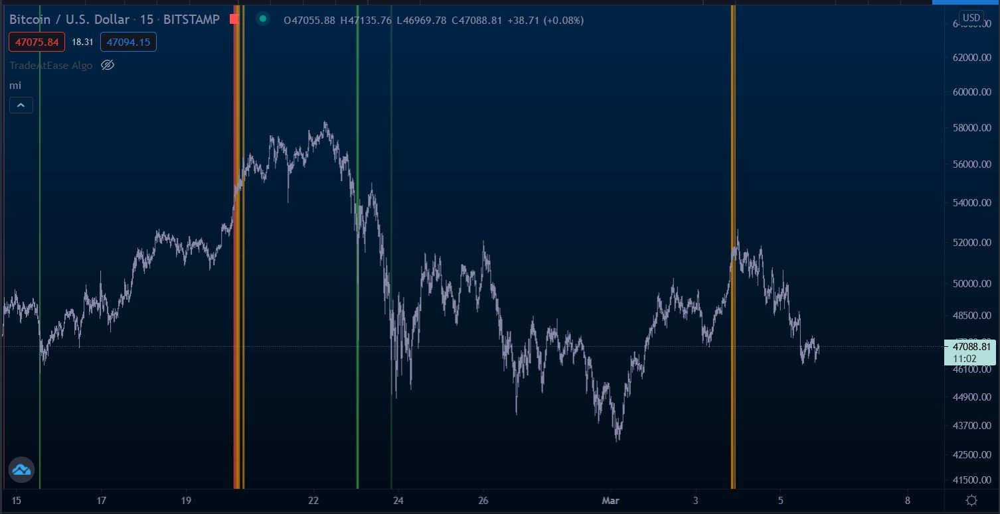

# WE not ME 

Welcome to the WE Indicator  (Bitcoin/Stock/$hitcoin Indicator)

**Telegram:** https://t.me/we_not_me

Donations are accepted, but really it's an invitation to give what feels right for the value received, but WE would sooner have you contribute to the project in forms of code, documentation, and helping each other in the Telegram chat.
**Bitcoin:** 3Ph9wP4vgASFbFP9DAabZETycXY66ebA8Y

## WE Indicator 

The WE indicator is the first indicator or three, the other two are called **Angel** and **Alpha**.
This is the fundamental starting point of this rapidly growing project, this project was initially started to develop a Macro Investment plan, this project brings together many different techniques into on project that will run on Tradingview using the pine programming language and is designed and programmed to effecient that it will run on the free account until, and then eventually WE will have more indicators once we develop into Tradingview paid plans, but the initial goal is to keep the barrier to entry for new investors and traders to a minimum.

**Features** of the indicator.
[PI Cycle](#pi-cycle)
[PI Cycle Inverse](#pi-cycle-inverse)
[Macro Cycles](#macro-cycles)
[DCA](#dca)
[LAMBS](#lamb)
Tom Demark sequences
Mayer multiples
Golden/Death Crosses
Short and Long entries
Bitcoin Log Growth Curves
RISK Curves, Curve Projection 
[RSI Background](#rsi-background)

## WE Indicator Angels

Documentation coming **Soon** 

**Features** of the first indicator.

## WE Indicator Alpha

# Installation

From the Github page, you copy the code of one script, and you paste it in Pine Editor.
Then you save it into the TradingView pine editor then it's available in my scripts in the indicators list.
There are two indicators one called we-indicator.pine and another called we-indicator-angels.pine
Documentation coming soon.

# PI Cycle
Documentation **coming soon**.

# PI Cycle Inverse
Documentation **coming soon**.

# Macro Cycle
Documentation **coming soon**.

# DCA
Documentation **coming soon**.

# LAMBS
Documentation **coming soon**.

# RSI Background 
The RSI Background Indicator is working as follow
* When the price starts being overbought, a red slightly transparent background will show up.
* When the price is overbought, the background becomes less transparent
* When the price starts being oversold, a green slightly transparent background will show up.
* When the price is oversold, the background becomes less transparent
* When the price is overbought and the MACD is identifying some reversal, the background becomes orange
    * ONLY EFFECTIVE IN A BULL RUN, ISN'T EFFICIENT IN ACCUMULATION / BEAR PHASE

### Example of oversold price

### Example of a divergence
When the price is overbought, but the price keeps increasing, it is a sign of a divergence. Mind the reversal !

### Example of overbought + MACD potential reversal (BULL RUN ONLY)
Daily Time Frame

4H Time Frame

1H Time Frame

15min Time Frame

