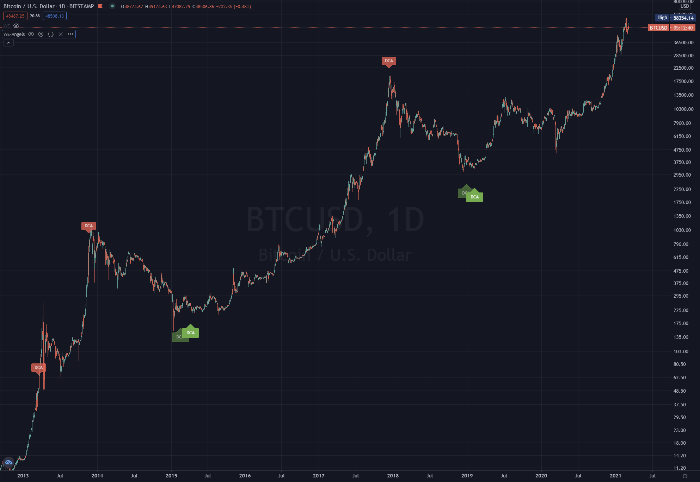

# WE not ME 

Welcome to the WE Indicator  (Bitcoin/Stock/$hitcoin Indicator)

**Telegram:** https://t.me/we_not_me

Donations are accepted, but really it's an invitation to give what feels right for the value received, but WE would sooner have you contribute to the project in forms of code, documentation, and helping each other in the Telegram chat.
**Bitcoin:** 3Ph9wP4vgASFbFP9DAabZETycXY66ebA8Y

## WE Indicator 

The WE indicator is the first indicator of three, the other two indicators are called **Angel** and **Alpha**, the free version of [Tradingview](https://www.tradingview.com) only allows three indicators to be run simultaneously,  but more WE indicators and studies will be implemented once WE expand beyond the initial development phase but keeping these three indicator being able to run on a free trading view account is an important part of the project.

This is the fundamental starting point of this rapidly growing project, this project was initially started to develop a Macro Investment plan, and brings together many different techniques into one project that runs on Tradingview using the pine programming language and is designed and programmed to efficient enough that it will run on the free account until WE have more indicators and develop into Tradingview paid plans, but the goal is to keep the barrier to entry for new investors and traders to an absolute minimum.

**Features** of the WE indicator.

- [PI Cycle](#pi-cycle)
- [PI Cycle Inverse](#pi-cycle-inverse)
- [DCA](#dca)
- [LAMB](#lamb)
- [Tom Demark (TD)](#tom-demark)
- Mayer multiples
- Golden/Death Crosses
- Bitcoin Log Growth Curves
- RISK Curves, Curve Projection 
- [RSI Background](#rsi-background)

## WE Indicator Angels

**Features** of the WE Angels indicator.

- [SMA Averages](#sma-averages)
- [SMA Angel Rainbow Averages](#sma-angel-rainbow-averages)
- [SMA Yearly Averages](#sma-yearly-averages)
- [Mayer Multiplier](#mayer-multiplier)
- [Short/Long](#short-long)
- [DCA](#dca)
- [DCA Lamb](#dca-lamb)
- [DEBUG](#debug)

## WE Indicator Alpha
Coming soon to be released .

# Installation

From the Github page, you copy the code of one script, and you paste it in Pine Editor.
Then you save it into the TradingView pine editor then it's available in my scripts in the indicators list.
There are two indicators one called we-indicator.pine and another called we-indicator-angels.pine
Documentation coming soon.

# WE-INDICATOR
# PI Cycle
Pi Cycle is a very useful indication of when the market is very overheated, so overheated that the shorter term moving average, which is the 111 day moving average, has reached a x2 multiple of the 350 day moving average. 
Historically it has proved advantageous to sell Bitcoin at this time in Bitcoin's price Cycle

https://www.lookintobitcoin.com/charts/pi-cycle-top-indicator/

# PI Cycle Inverse
Documentation **coming soon**.

# DCA
Documentation **coming soon**.

# LAMB
Documentation **coming soon**.

# Tom Demark
The WE indicator has an implementation of the TD Sequential with the we-indicator, but eventually WE plan on implementing more studies relating to the Tom DeMark 

Tom DeMark, is used by many of the top money managers of all time, the DeMARK Indicators on heavily used on Bloomberg  it's an approach to those seeking a deeper, more comprehensive understanding of the market, these are not 'technical' indicators in the conventional sense rather market timing tools that are compatible with fundamental analysis.

- **[TD Sequential](https://hackernoon.com/how-to-buy-sell-cryptocurrency-with-number-indicator-td-sequential-5af46f0ebce1)**
- TD Combo 
- TD Alignment
- TD DeMarker
- TD Pressure
- TD REI
- TD ROC
- TD Channel
- TD Differential
- TD D-Wave
- TD Lines
- TD Propulsion
- TD Range

https://demark.com/bookshelf/

# RSI Background 
The RSI Background Indicator is working as follow
* When the price starts being overbought, a red slightly transparent background will show up.
* When the price is overbought, the background becomes less transparent
* When the price starts being oversold, a green slightly transparent background will show up.
* When the price is oversold, the background becomes less transparent
* When the price is overbought and the MACD is identifying some reversal, the background becomes orange
    * ONLY EFFECTIVE IN A BULL RUN, ISN'T EFFICIENT IN ACCUMULATION / BEAR PHASE

### Example of oversold price

### Example of a divergence
When the price is overbought, but the price keeps increasing, it is a sign of a divergence. Mind the reversal !

### Example of overbought + MACD potential reversal (BULL RUN ONLY)
Daily Time Frame

4H Time Frame

1H Time Frame

15min Time Frame

# WE-ANGELS-INDICATOR

# SMA Averages
Documentation **coming soon**.

# SMA Angel Averages
Documentation **coming soon**.

# SMA Angel Rainbow Averages
Documentation **coming soon**.

# SMA Yearly Averages
Documentation **coming soon**.

# Mayer Multiplier
Documentation **coming soon**.

# Short Long
Documentation **coming soon**.

# DCA
Documentation **coming soon**.

# DCA Lamb
Documentation **coming soon**.

# DEBUG
Documentation **coming soon**.

# WE-ALPHA-INDICATOR
Documentation **coming soon**.
