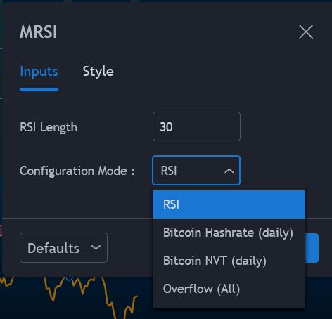
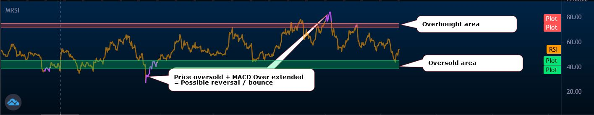
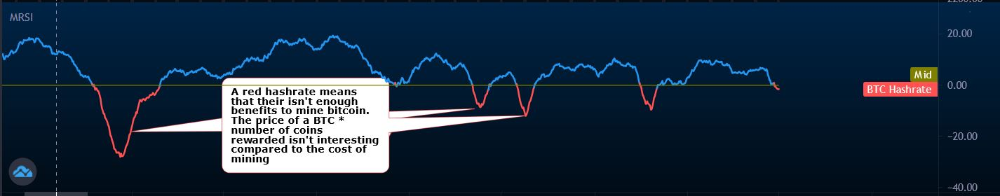
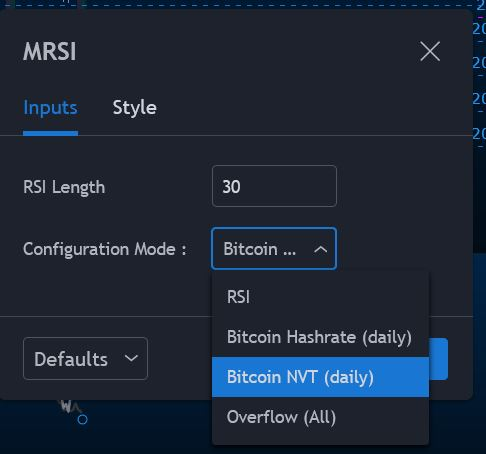
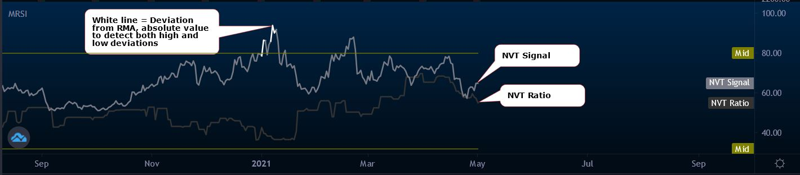
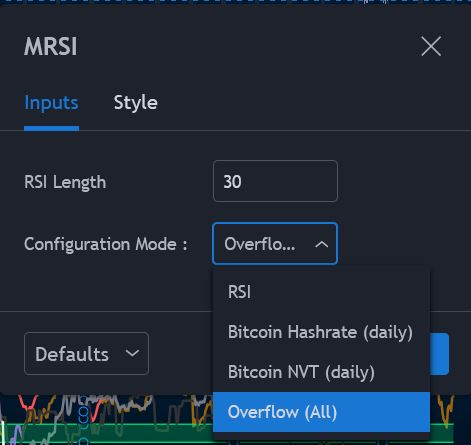
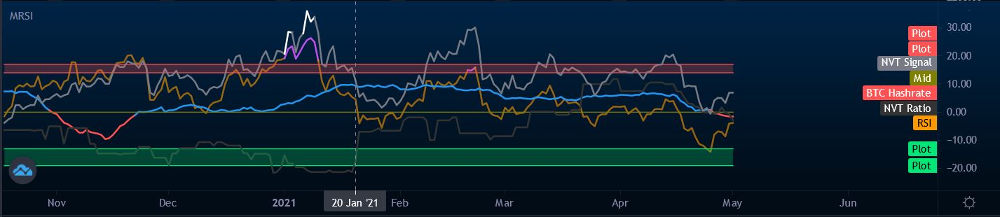

# we-not-me Thomas
Bitcoin Indicator - Studies

## Personal RSI + Bitcoin Info indicator
Note that the Bitcoin Info indicators are shown on the daily time frame only as they are not really relevant in other time frames.

### Relative Strength Index (RSI)
The relative strength index (RSI) is a momentum indicator used in technical analysis that measures the magnitude of recent price changes to evaluate overbought or oversold conditions in the price of a stock or other asset.

#### Show RSI (only)

#### RSI chart

### Bitcoin Hashrate
Put simply, hash rate is a general measure of the processing power of the Bitcoin network.
Mining hashrate is a key security metric. The more hashing (computing) power in the network, the greater its security and its overall resistance to attack. Although Bitcoin’s exact hashing power is unknown, it is possible to estimate it from the number of blocks being mined and the current block difficulty.
This means that hash rate is a good indicator of the Bitcoin network’s health.
Generally speaking, as hash rate increase, so does Bitcoin’s mining difficulty, the more difficult it is to mine, the less rewards miners get, the
less interesting it is to keep machines connected to the network.

* Typo here, the red line is when it becomes beneficial again to mine.

### Bitcoin Network Valuation by Transaction Value (NVT)
In traditional stock markets, price-earnings ratio (PE Ratio) has been a long standing tool for valuing companies. It’s simply the ratio of a company’s share price to its equivalent earnings per share. A high ratio describes either over valuation or a company in high growth.

What would be the equivalent in Bitcoin-land? We have a price per token, but it’s not a company so there are no earnings to do a ratio. However since Bitcoin at its essence is a payments and store of value network[2], we can look to the money flowing through its network as a proxy to "company earnings”.

#### NVT Ratio
Simply the Network Value divided by Daily Transaction Value
A high NVT Ratio can indicate high speculative value (Overbought)
A low NVT Ratio can indicate low speculative value (Oversold)

#### NVT Signal
NVT Signal is a derivative of NVT Ratio which provides more emphasis on predictive signaling ahead of price peaks.
NVTS = Network Value / 90d MA of Daily Transaction Value.

#### Show NVT (only)

#### NVT chart

### Overflow mode
Show all 3 indicators at the same time.

