# RSI Oversold / Overbought + MACD Overextend Indicator

The purpose of this indicator is  to identify, across multiple time frame, when the price
is oversold or overbought, as well potential reversal through an overextended MACD.

The RSI is based on a length of 14 for 1 min and 15 min time frames, and 30 for other time frames.

When scalping the reversal based on this indicator, a target for a TP is between 0.382 and 0.618 fib level (see examples at the bottom of this page)

As a confirmation of reversal, 2 additional colors can be taken into account, orange and blue. This is based on the MACD.
WARNING : This additional confirmation of reversal is way more accurate on a bull run

**How to spot a divergence : When the price keeps moving in the same direction, but the background goes from light to dark to no background**

## Configuration Options
<< Show Overbought/Oversold + MACD match only >> hides overbought and oversold if they don't match with the macd signal.
* Show Overbought/Oversold + MACD match only = OFF
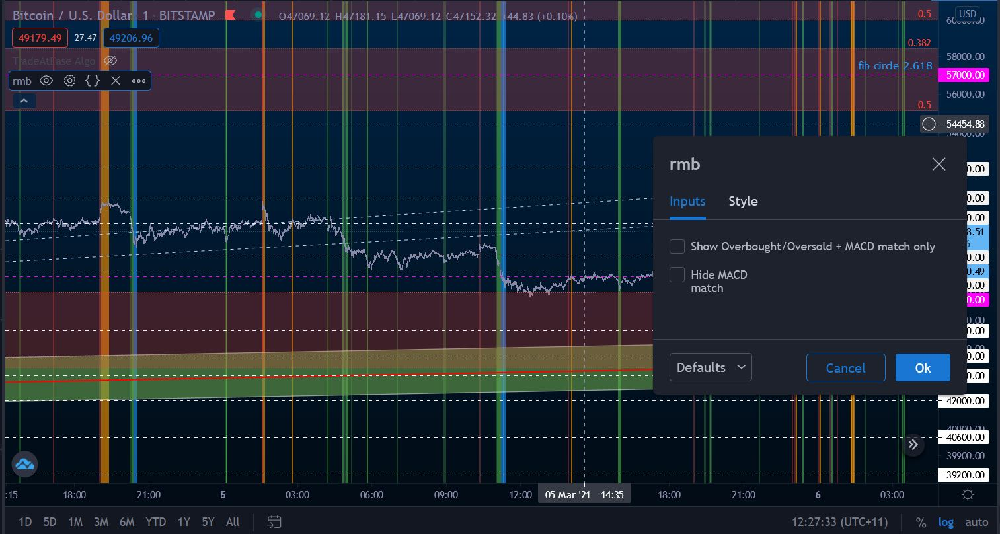
* Show Overbought/Oversold + MACD match only = ON
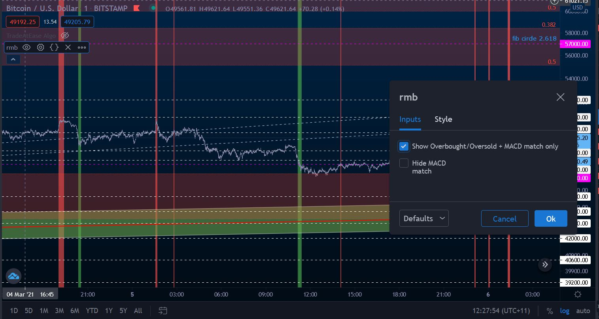

<< Hide MACD match, show only overbought/oversold >> hides MACD related colors.
* Show Overbought/Oversold + MACD match only = OFF
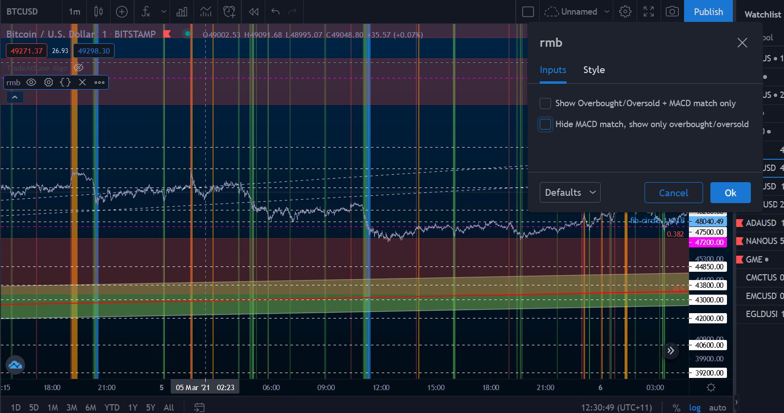
* Show Overbought/Oversold + MACD match only = ON
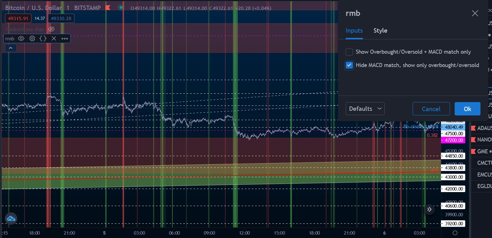

## Over Sold

When the price is oversold, it means that the RSI is around 30.
There is 2 oversold colors
* Green with a bit of transparency = Start to be oversold
* Green with no transparency = Price Oversold, area of reversal

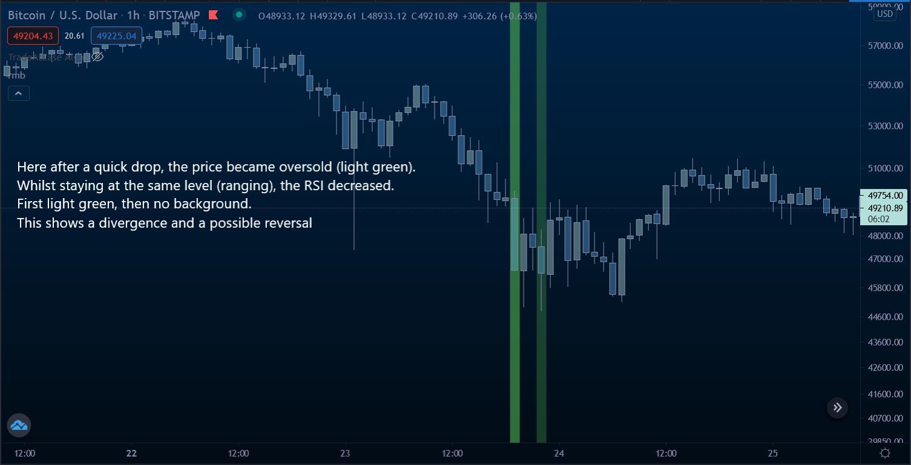

## Over Bought

When the price is oversold, it means that the RSI is around 70.
There is 2 oversold colors
* Red with a bit of transparency = Start to be overbought
* Red with no transparency = Price Oversold, area of overbought

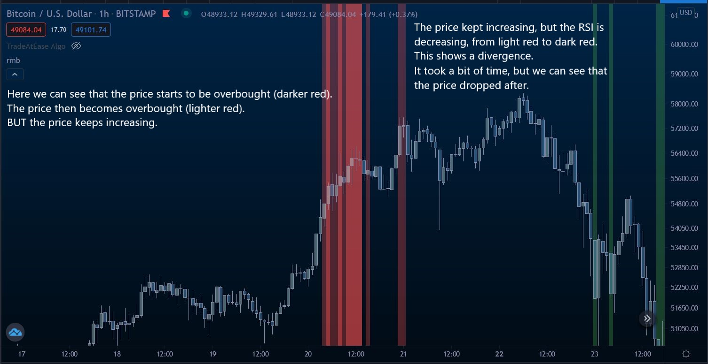

## MACD Based Colors

When the background is orange, it means that the price starts to be overbought, or is completely overbought, and
the MACD is showing sign of reversal.
When the background is blue, it means that the price starts to be oversold, or is completely oversold, and
the MACD is showing sign of reversal.
It can remain orange or blue for a couple of candles before having the reversal, or the price can keep increasing.
If the price keeps increasing, that also means that there is a divergence.

### 4 Hours
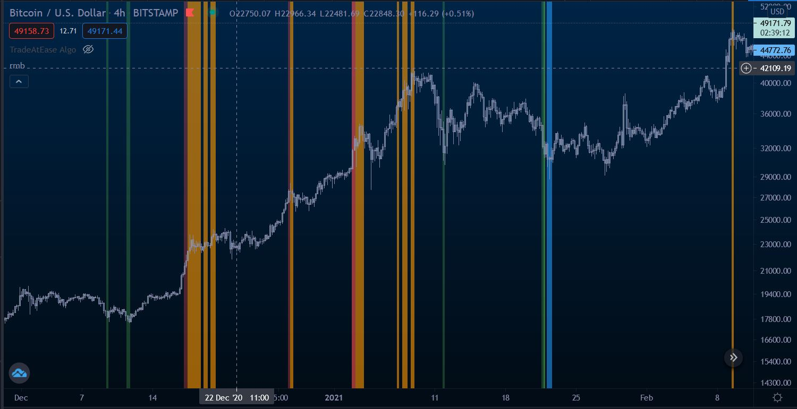

### 1 Hours
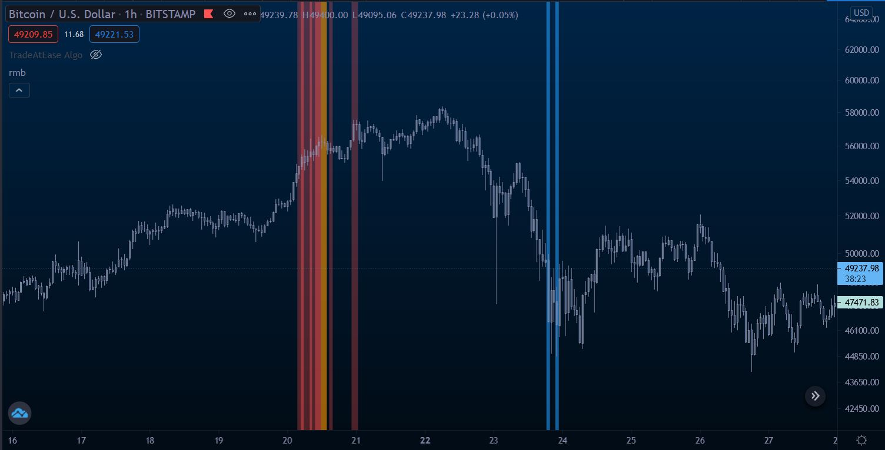

### 15 Minutes
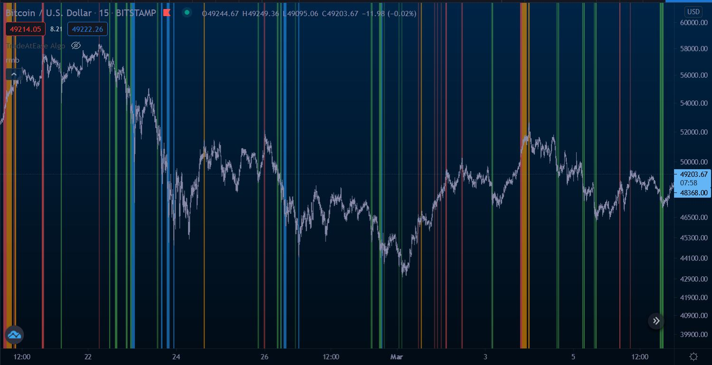

### 1 Minute
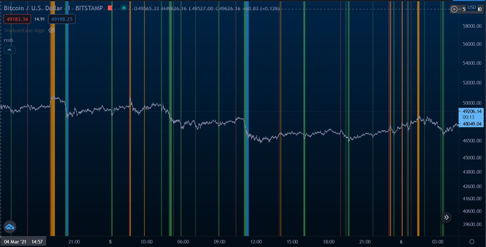

## Examples

### 4 Hours Time Frame Oversold
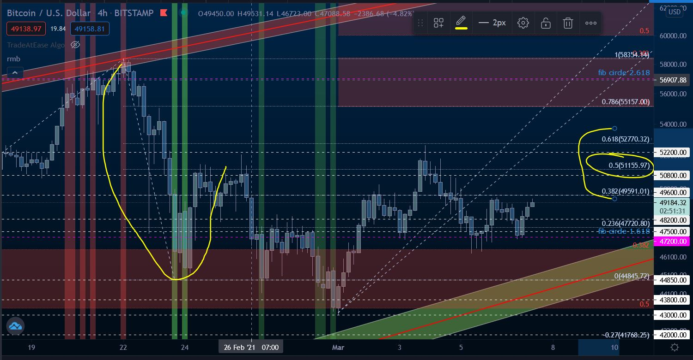

### 4 Hours Time Frame Overbought
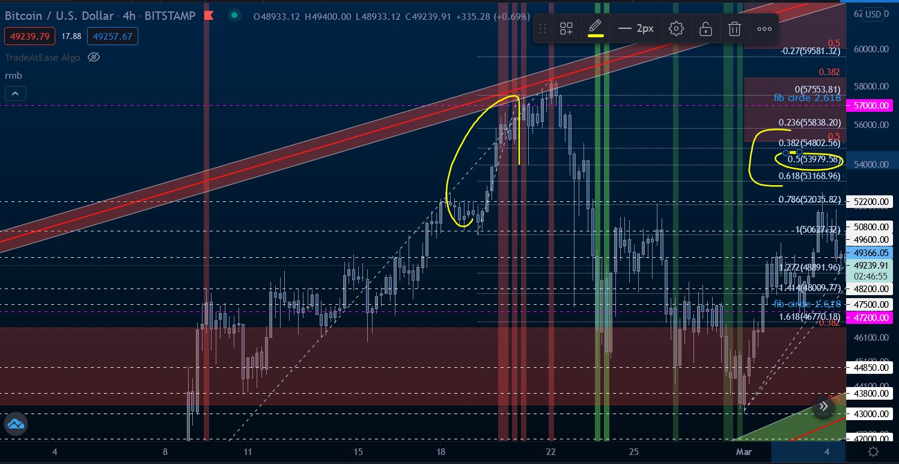

### 1 Hours Time Frame Oversold
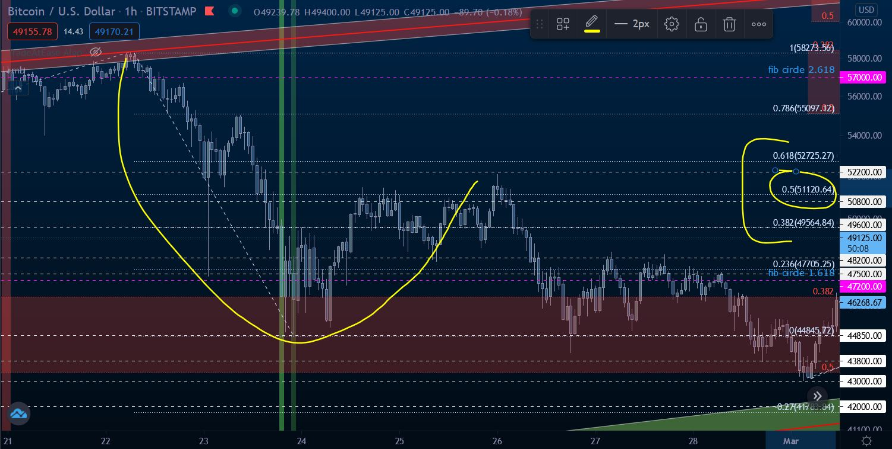

### 1 Hours Time Frame Overbought
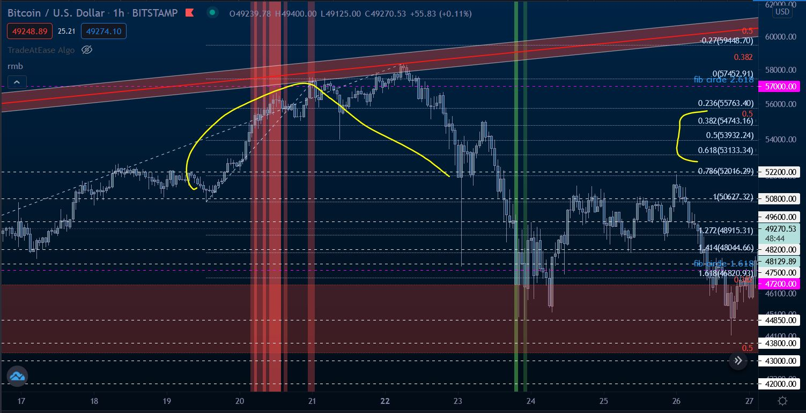
